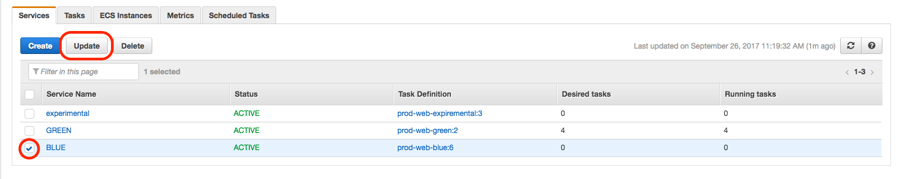

# Building and Deploying Web Container

## Building Web Container

### Prequisites
* Docker installed on local machine(Download Docker from the website https://www.docker.com/)
* AWS S3 access to `xxxxxxxxxx-xxxxxxxxxx-pkg`
* Be part of the Docker File Access Team in GitHub

### Build Base Container
1. Clone xxxxxxxxxx_dockerfiles to your local machine
2. `cd` in `xxxxxxxxxx_dockerfiles/xxxxxxxxxx_web`
3. Run ./build-base.sh
4. Run `docker images` and verify that you have a docker image called web-base

### Build Main Container
1. Clone xxxxxxxxxx_dockerfiles to your local machine
2. `cd` in `xxxxxxxxxx_dockerfiles/xxxxxxxxxx_web`
3. Modify `step2_build_base.sh`, line 12 to use appropriate repository. For prod: `DOCKER_REPOSITORY=xom-prod-web` For QA: `DOCKER_REPOSITORY=xom-qa-web`
4. Run `./build.sh`
5. Select all of the Git branches you would like for the build(or use [manifest.md](./manifest.md) for the most recent prod configuration)
6. Let build
7. Run `docker images` and validate repository name is correct

### Validating Build
1. Run `docker images` and copy the container ID of the most recent build
2. Run `docker run <Image ID>` to run container inline
3. Success looks like `gulp` running and `Apache2` logs printing with no error(Process should stay running inline until you cancel it)

## Deploying Web Container

### Prequisites
* AWS ECS Full Access
* Docker installed on local machine(For now)

### Pushing Docker Image (Assuming production deployment)
1. Check which service is currently running in AWS ECS console(Blue|Green) 
2. Tag you new docker image as the service that is *not* currently running

```bash
# If tagging blue
docker tag xxxxxxxxxx/xom-prod-web:latest xxxxxxxxxx/xom-prod-web:blue
# If tagging green
docker tag xxxxxxxxxx/xom-prod-web:latest xxxxxxxxxx/xom-prod-web:green
```
3. Get AWS ECR token and login with docker in order to push your new image

```bash
aws ecr get-login --no-include-email --region us-west-2
# Output should look like this:
docker login -u AWS -p <Some Large Token> https://xxxxxxxxxx
# If you are using windows run this to get the login command
Invoke-Expression -Command (aws ecr get-login --no-include-email --region us-west-2)
```
4. Copy and Run `docker login` command

```bash
docker login -u AWS -p <Some Large Token> https://xxxxxxxxxx
```
5. Push your tagged image to the docker image repository

```bash
docker push xxxxxxxxxx/xom-prod-web:(blue|green)
```

### Deploying New Containers
1. Navigate to AWS ECS in the console and select the `prod-web` cluster 
2. Click on the ECS Instances tab and click `Scale ECS Instances` and scale from 4 to 8 instances 
3. Click back to the Services tab and check the service that currently has 0 running tasks and click update 
4. Update the `Number of tasks` field to 8 and click through the wizard 
5. Click on the Tasks tab and wait for an addition 4 tasks to appear and begin running(refresh periodically)
6. Once there are 8 tasks running navigate back to the Services tab
7. Check the oppisite service from the service you updated in step 3. and click update
8. Update the `Number of tasks` field to 0 and click through the wizard
9. Click to the Tasks tab and wait for 4 task to stop and a new 4 to start(All 8 services should be the service you selected in step 3.)
10. Navigate back to the ECS Instances tab and select `Scale ECS Instances` and scale back down to 4 instances
11. Finally go back to the Services tab and check the same service you checked in step 3. and update the `Number of tasks` field to 4(The number of ECS Instance you have)
